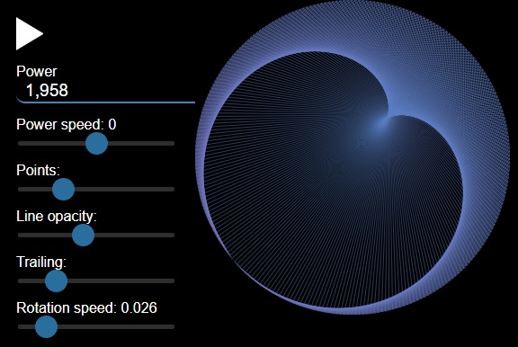

# Caustic reflections in a cup of coffee

Real life             |  Simulation
:-------------------------:|:-------------------------:
  |  

## Motivation
Inspired fom [this article](http://lacim.uqam.ca/~plouffe/cercles/circles.html)

## Preview
http://htmlpreview.github.io/?https://github.com/QTimort/coffee-cup-light-rays/blob/master/dist/index.html

## Cool examples
1. Stop the animation, set 'power' to 177 and 'points' to 532 and press play!

## Setup
1.  Install dependencies:

        yarn

    or

        npm ci

2.  Run webpack:

        npm start

You should now be able to see the animation working on: http://localhost:3000
